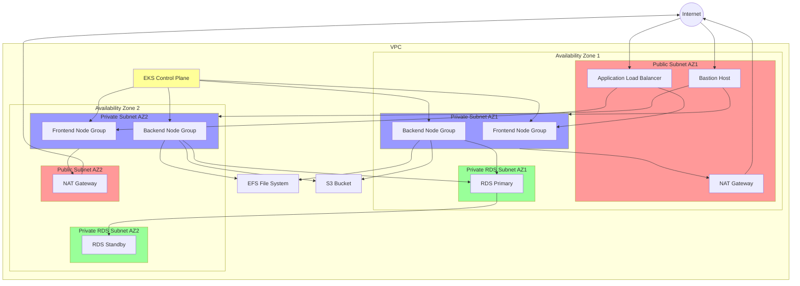

# AWS Architecture Diagram

## Infrastructure Overview

## Architecture Components

### Networking
- **VPC**: Custom VPC with defined CIDR range
- **Availability Zones**: Deployed across 2 AZs for high availability
- **Subnets**:
  - Public Subnets (2): For ALB and Bastion hosts
  - Private Application Subnets (2): For EKS worker nodes
  - Private RDS Subnets (2): For database instances

### Compute
- **EKS Cluster**:
  - Managed control plane
  - Frontend Node Groups
  - Backend Node Groups
- **Bastion Host**: For secure access to private resources

### Database
- **RDS**:
  - Primary instance in AZ1
  - Standby instance in AZ2 for high availability

### Storage
- **EFS**: Shared file system for persistent storage
- **S3**: Object storage for application data

### Security
- **Security Groups**: Configured for each component
- **NACLs**: Network access control at subnet level
- **IAM Roles**: For EKS and service accounts

### Load Balancing
- **Application Load Balancer**: For distributing traffic to EKS nodes

### Networking Components
- **Internet Gateway**: For public internet access
- **NAT Gateways**: For private subnet internet access
- **Route Tables**: Configured for public and private subnets

## High Availability Features
1. Multi-AZ deployment
2. Redundant NAT Gateways
3. RDS Multi-AZ configuration
4. EKS worker nodes across multiple AZs
5. Load balancer for traffic distribution
